# Meta Harness Architecture

The "meta harness" is the orchestration layer that wraps the Cline SDK (`@cline/sdk`) with inter-agent communication, shared state, scheduling, and robustness mechanisms. It turns isolated AI agents into a collaborative "office" of workers.

## Key Components

| Component | File | Role |
|---|---|---|
| **AgentManager** | `server/manager.ts` | Central orchestrator — assigns tasks, manages queues, handoffs, schedules, circuit breakers |
| **runCline (ProviderRunner)** | `server/providers/cline.ts` | Executes agent tasks via Cline SDK, manages conversation state, message compaction |
| **makeTools** | `server/providers/cline.ts` | Assembles all tools available to an agent (built-in + custom + inter-agent + MCP) |
| **OfficeState** | `server/office-state.ts` | Shared DAG of tasks/decisions/blockers/observations for cross-agent coordination |
| **AgentMail** | `server/agent-mail.ts` | FIPA-lite messaging with performatives and priorities |
| **RunContext** | `server/providers/types.ts` | Contract object passed to runners — carries cwd, callbacks, officeState, abort controller |
| **Scheduler** | `server/manager.ts` | Cron-like recurring tasks + pipeline chains |
| **Circuit Breaker** | `server/manager.ts` | Detects runaway agents (duplicate tool calls, max calls per tool, MCP call limits) |
| **Sandboxing** | `server/providers/cline.ts` | Bubblewrap (`bwrap`) confinement for agent shell commands in production |

## Architecture Diagram

```mermaid
graph TD
    User["User / Platform Events"] -->|assign, createSchedule, createScheduleChain| Mgr
    Mgr{"Assign Task"} -->|agent busy| Queue["Task Queue (MAX_QUEUE_DEPTH: 5)"]
    Queue -->|agent idle| StartTask["startTask"]
    Mgr -->|agent idle| StartTask
    StartTask -->|monitor| Breaker{"Circuit Breaker (3 dup / 10 per-tool / 20 MCP)"}
    StartTask -->|monitor| DoneTimer["Done Timer (90s idle timeout)"]
    Breaker -->|threshold exceeded| Abort["Abort + Error Status"]
    DoneTimer -->|timeout| Abort

    SchedTick["tickSchedules (60s)"] -->|fires due| SchedMap["Schedules Map"]
    SchedMap -->|chainTo| ChainTrigger["Chain Trigger"]
    ChainTrigger -->|assign next agent| Mgr
    SchedMap -->|assign agent| Mgr

    StartTask --> RtState["Agent State (status, task, memory)"]
    RtState --> SysPrompt["Build System Prompt + memory + journal"]
    SysPrompt --> Runner["runCline (ProviderRunner)"]
    Runner --> EventLoop["Event Stream Loop"]
    EventLoop --> Sanitize["Message Sanitization & Compaction"]
    Sanitize -->|compacted history| Runner

    Runner -->|creates| SDKAgent["Cline SDK Agent"]
    SDKAgent -->|invokes| SDKTools["createDefaultTools / createDefaultExecutors"]
    SDKAgent -->|uses| Tools["makeTools (cline.ts)"]
    Tools -->|tool results| SDKAgent
    SDKAgent -->|events / output| EventLoop

    Tools --> T_Bash["bash"]
    Tools --> T_Read["read_files"]
    Tools --> T_Write["write_files"]
    Tools --> T_Editor["editor"]
    Tools --> T_ReadShared["read_shared"]
    Tools --> T_WriteShared["write_shared"]
    Tools --> T_ListShared["list_shared"]
    Tools --> T_Post["post_message"]
    Tools --> T_ReadMsg["read_messages"]
    Tools --> T_WaitReply["wait_for_reply"]
    Tools --> T_AskMgr["ask_manager"]
    Tools --> T_Propose["propose_action"]
    Tools --> T_ReadBoard["read_board"]
    Tools --> T_ClaimCard["claim_card"]
    Tools --> T_CreateSched["create_schedule"]
    Tools --> T_ListSched["list_schedules"]
    Tools --> T_UpdateSched["update_schedule"]
    Tools --> T_DeleteSched["delete_schedule"]
    Tools --> T_Hire["hire_agent"]
    Tools --> T_Delegate["delegate_task"]
    Tools --> T_RequestHire["request_hire"]
    Tools --> T_RegisterMcp["register_mcp_server"]
    Tools --> T_ListMcp["list_office_tools"]
    Tools --> T_Railway["Railway"]
    Tools --> T_Google["Google Workspace"]
    Tools --> T_CDPSolana["CDP Solana"]
    Tools --> T_Crossmint["Crossmint Wallet"]
    Tools --> T_Circle["Circle Services"]
    Tools --> T_Monid["Monid"]
    Tools --> T_Wizard["Wizard GitHub"]

    Runner -->|reads context| OSContext["getAgentContext / getCriticalPath / findBlockers"]
    Runner -->|addNode / addEdge| OSNodes["OfficeState Nodes (task, decision, blocker, observation)"]
    OSContext -->|shared context| Runner
    OSContext -->|queries| OSNodes
    OSNodes --- OSEdges["Edges (depends_on, blocks, produced_by, decided_in, contradicts)"]
    OSContext -->|queries| OSEdges

    T_Post -->|onPostMessage callback| Mgr
    Mgr -->|shouldCreateTask?| ShouldCreateTask["shouldCreateTask"]
    ShouldCreateTask -->|yes: create task| Mgr
    T_ReadMsg -->|reads| Mailbox["Agent Inbox"]
    T_WaitReply -->|polls| Mailbox
    Performatives["Performatives (request, inform, query, propose, subscribe)"] --> Mailbox
    Priorities["Priority (low, normal, urgent)"] --> Mailbox
    Mailbox --> ShouldCreateTask

    T_Bash -->|production| Bwrap["bubblewrap confinement (bwrapCommand)"]
    BwrapCheck["checkBwrap"] -->|verifies| Bwrap

    EventLoop -->|task complete| Handoff{"Process Result (handoffTo?)"}
    Handoff -->|yes: handoffTo| Mgr
    Handoff -->|no| BoardUpdate["Update Task Board"]
    Handoff -->|update| OSNodes

    style Mgr fill:#6c7ae0,stroke:#333,stroke-width:2px,color:#fff
    style StartTask fill:#6c7ae0,stroke:#333,stroke-width:2px,color:#fff
    style Handoff fill:#6c7ae0,stroke:#333,stroke-width:2px,color:#fff
    style Breaker fill:#e74c3c,stroke:#333,stroke-width:2px,color:#fff
    style Abort fill:#e74c3c,stroke:#333,stroke-width:1px,color:#fff
    style Runner fill:#27ae60,stroke:#333,stroke-width:2px,color:#fff
    style SDKAgent fill:#2ecc71,stroke:#333,stroke-width:2px,color:#fff
    style Tools fill:#f39c12,stroke:#333,stroke-width:2px,color:#fff
    style OSNodes fill:#9b59b6,stroke:#333,stroke-width:2px,color:#fff
    style OSContext fill:#9b59b6,stroke:#333,stroke-width:1px,color:#fff
    style Mailbox fill:#e67e22,stroke:#333,stroke-width:2px,color:#fff
    style ShouldCreateTask fill:#e67e22,stroke:#333,stroke-width:1px,color:#fff
    style Bwrap fill:#95a5a6,stroke:#333,stroke-width:2px,color:#fff
    style SchedTick fill:#3498db,stroke:#333,stroke-width:2px,color:#fff
    style ChainTrigger fill:#3498db,stroke:#333,stroke-width:1px,color:#fff
    style Queue fill:#bdc3c7,stroke:#333,stroke-width:1px
    style DoneTimer fill:#e74c3c,stroke:#333,stroke-width:1px,color:#fff
```

## Key Flows

### Task Lifecycle
1. User or platform event triggers `assign` / `createSchedule` / `createScheduleChain`
2. `AgentManager.assign()` queues or starts the task on the target `AgentRuntime`
3. `startTask()` builds the system prompt (with memory summaries + journal entries) and invokes `runCline`
4. `runCline` creates a Cline SDK `Agent` with assembled tools from `makeTools`
5. Agent executes, streaming events back through the `ProviderRunner`
6. On completion, `handoffTo` (if set) triggers the next agent's task

### Inter-Agent Messaging
1. Agent A calls `post_message` tool → `onPostMessage` callback in `AgentManager`
2. Manager looks up recipient by folder name, creates `AgentMessage` with performative + priority
3. `shouldCreateTask()` decides whether to create a task for the recipient (urgent requests to idle agents do)
4. Recipient reads messages via `read_messages` or `wait_for_reply` tools

### OfficeState Coordination
1. Agent reads shared context via `getAgentContext()` — gets recent decisions, blockers, critical path
2. Agent makes decisions, encounters blockers, or produces observations → calls `addNode` / `addEdge`
3. Other agents query the DAG for dependencies, contradictions, and decision trails

### Pipeline Chains
1. `createScheduleChain` links multiple schedules sequentially (`chainTo` field)
2. `tickSchedules` fires due schedules → task runs → `updateScheduleResult` checks `chainTo`
3. If next schedule exists and its agent is idle, chain trigger fires → next task assigned

### Circuit Breaker
1. Each tool call increments breaker counters (per-tool, per-duplicate, MCP total)
2. If any threshold exceeded (`MAX_DUPLICATE_TOOL_CALLS: 3`, `MAX_CALLS_PER_TOOL: 10`, `MAX_MCP_TOOL_CALLS: 20`), agent is aborted with error status
3. `TASK_IDLE_TIMEOUT_MS: 90s` — if agent shows no activity, done timer fires and aborts

### Sandboxing
1. In production, `bash` tool commands are wrapped in `bubblewrap` (`bwrap`) confinement
2. `checkBwrap` verifies bubblewrap is available before enabling sandboxing
3. Prevents agents from accessing filesystem outside their workspace
